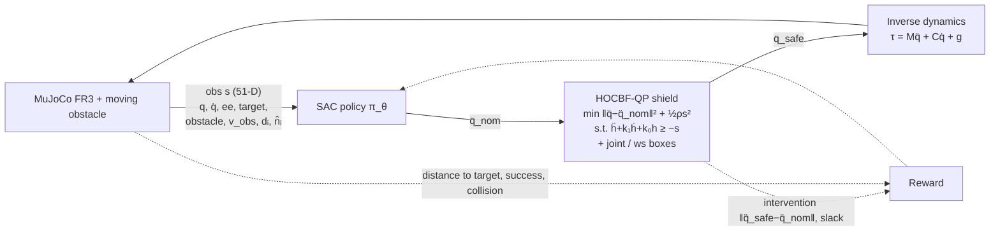
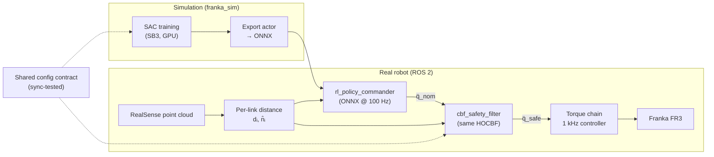
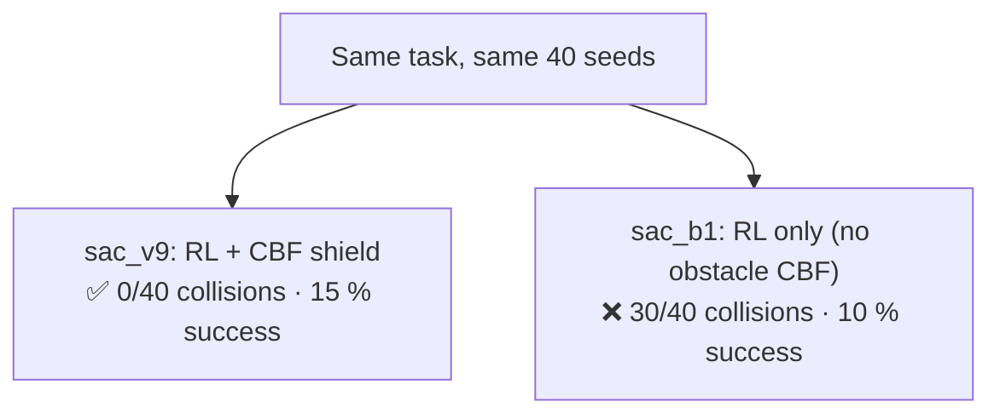

# Safe Reinforcement Learning with a CBF Shield — Research Progress Summary

> **How to use this file:** paste it into Claude and ask for *"one or two slides and a diagram"*.
> Section 9 has a proposed slide layout, and Section 10 has ready-to-render diagrams (Mermaid).

---

## 1. One-line summary

A **SAC policy** learns to reach targets with a **Franka FR3** arm while a moving obstacle (a proxy for a human) sweeps the workspace.
Every action the policy proposes passes through an **acceleration-level Control Barrier Function (HOCBF) QP shield**.
The shield is the **same one that runs on the real robot**, so exploration is safe in simulation and execution is certified on hardware.

**Key idea: the policy owns *avoidance*, and the CBF only *certifies* safety.**
The goal is a policy that avoids the obstacle proactively, so the shield rarely has to intervene.

---

## 2. Problem setting

| Item | Value |
|---|---|
| Robot | Franka Research 3 (7-DoF) with the Franka Hand |
| Simulator | MuJoCo 3.4 (Menagerie FR3), Gymnasium env `FrankaCBF-v0` |
| Task | Reach a random target (tolerance 5 cm) in a 5 s episode (500 steps at 100 Hz) |
| Obstacle | Moving sphere (r = 8 cm), sinusoidal motion at 0.2 Hz × 0.2 m, peak ≈ 0.25 m/s (the ISO/TS 15066 reduced-speed order of magnitude) |
| Difficulty | `blocking_fraction = 0.6`: 60 % of episodes put the obstacle *on* the straight EE→target path, which forces a detour |
| Safety distance | d_safe = 0.15 m (the value tuned on the real robot) |

---

## 3. MDP formulation

### Action (7-D)
The action is the nominal joint acceleration **q̈_nom = a · q̈_max**, with a ∈ [−1, 1]⁷.
This is the same interface the real `cbf_safety_filter` node accepts, so the policy drops into the robot pipeline unchanged.

### Observation (51-D)
| Block | Dim | Content |
|---|---|---|
| Robot state | 14 | q, q̇ |
| Task | 6 | EE position, target position |
| Obstacle | 4 | obstacle centre, d_min |
| Obstacle velocity | 3 | v_obs (finite difference of the *observed* centre) |
| Per-link geometry | 24 | 6 control points × (distance dᵢ, normal n̂ᵢ) |

The observation grew from 24-D to 51-D, and this was a **key design finding**:
- **Without v_obs**, "approaching" and "receding" produced the same observation but needed opposite actions. The task was a POMDP treated as an MDP.
- **Without the per-link (dᵢ, n̂ᵢ)**, the policy knew *less* than the shield it was supposed to pre-empt. It could not tell which link was threatened, or which way to go around.
- (dᵢ, n̂ᵢ) is also **scene-agnostic**: it is exactly what the robot's point-cloud distance pipeline produces.

### Reward
r = − w_dist·‖ee − target‖ + w_success·𝟙[success]
  − w_intervention·‖q̈_safe − q̈_nom‖ − w_slack·s
  − w_action·‖a‖² − w_smooth·‖Δq̈‖ − w_qdot·‖q̇‖²
  − w_ws_margin·(anticipatory workspace-wall ramp)
  − collision_penalty (terminal)

The **intervention term** is central: it teaches the policy to propose actions the shield does not need to bend.

---

## 4. The safety shield (HOCBF-QP)

The barrier is **h(q) = d(q) − d_safe**, computed per control point on 6 robot links.
Because the control input is an acceleration (relative degree 2), the constraint is a High-Order CBF:

  **ḧ + k₁·ḣ + k₀·h ≥ −s**, with ḣ = n̂ᵀJₚq̇ and ḧ = n̂ᵀ(Jₚq̈ + J̇ₚq̇)

At every tick (100 Hz), the shield solves the QP:

  **min ‖q̈ − q̈_nom‖² + ½ρs²**
  subject to: the obstacle HOCBF rows (soft, with slack s), a hard joint position/velocity/acceleration box, a slew-rate box, and a hard EE workspace box.

- The QP is solved with OSQP. The gains (k₀ = 25, k₁ = 10.5, ρ = 1000) are **mirrored from the real robot config**.
- A unit test fails if the simulation config and the robot config drift apart (`test_real_configs_are_in_sync`).
- Actuation uses inverse-dynamics torque: **τ = M(q)q̈_safe + C(q, q̇)q̇ + g(q)** (`mj_inverse`). This is the same torque chain as the real stack.

---

## 5. Algorithm choice: SAC (off-policy)

- **Stable-Baselines3 SAC**: MLP [256, 256], 8 parallel envs, 2M steps, buffer 1M, batch 512, automatic entropy tuning. About 5 h on an RTX 4070 Laptop GPU.
- **Why off-policy and not PPO:** the shield makes the *executed* action differ from the *sampled* action, so the behaviour policy is **π ∘ CBF**. PPO's importance ratio is invalid by construction. **Shielded RL is inherently off-policy.**
- **γ = 0.997** instead of 0.99. At 100 Hz, γ = 0.99 is a horizon of only ≈ 1 s. A detour is "pay now, arrive later" (2–3 s), so the value function could not see the benefit of going around. γ = 0.997 gives ≈ 3.3 s.

---

## 6. Sim-to-real pipeline (implemented end-to-end)

1. **Train** in MuJoCo with SAC and the shield.
2. **Export** the actor to **ONNX** (validated against SB3 to within 2.7 × 10⁻⁷).
3. **Deploy** with the ROS 2 node `rl_policy_commander`. It runs the ONNX actor at 100 Hz and publishes `/qddot_nom` into the **unchanged** real `cbf_safety_filter`, then the torque chain drives the FR3.
4. A single contract module (`rl_policy.py`) rebuilds the *identical* observation on the robot from the point-cloud distances. A smoke test shows the command is **bit-equal** to an independent offline replay.
5. Deployment is selected with a launch flag: `motion_source:=rl`.

**Declared gap (be honest on the slide):** the policy trains under a *subset* of the deployed shield. The robot adds self-collision, singularity, link-speed and latency-compensation rows, among others. The gap is conservative in direction but not yet verified. Domain randomisation (latency, observation noise, dynamics) is implemented but **off** so far.

---

## 7. Experimental iterations and results

**Evaluation protocol:** 40 episodes on independent seeds (1000–1039), compared against zero-action and random baselines.
The built-in 10-episode eval curve turned out to be noise; it swung from 0 % to 70 % to 40 % between checkpoints.

| Run | Change | Success | Collisions | Takeaway |
|---|---|---|---|---|
| sac_v4 | 24-D obs, γ = 0.99, mostly unobstructed task | 86 % (50 ep) | **0 %** | Reaching is solved, but half the benchmark never needed avoidance. With the obstacle on the path, success dropped to 56 %. |
| sac_v7 | 51-D obs, γ = 0.997, 60 % blocked episodes | 17.5 % | **0 / 40** | Much harder task. The shield never fails; every failure is a timeout. |
| sac_v8 | + workspace-margin ramp, + higher w_intervention | 10 % | **0 / 40** | Corner-pin failure fixed, but the higher intervention cost made the policy hesitant near the obstacle. |
| sac_v9 | workspace ramp only (isolated change) | 15 % | **0 / 40** | Corner pin stays fixed. "Hovering at the d_safe boundary" is still unsolved. |
| **sac_b1** (ablation) | **No obstacle CBF**: RL alone must avoid | 10 % | **30 / 40** | Without the shield, RL collides in 75 % of episodes. The reward-hack "crash early to end the episode" also came back. |
| sac_b2 (running) | No CBF + potential-based shaping + collision cost scaled by remaining steps | ~6–7 % (training) | ~0 (training) | Crash hack removed. Training is at 1.42M / 2M steps. |

Note: with n = 40, the v7/v8/v9 success rates fall within binomial noise (about ±11 %). The safety result (0 collisions vs 30/40) is the clear signal.

### Key findings (the story for the slide)
1. **The CBF shield works as a certificate: 0 collisions** in every shielded run. Without it (the ablation), the policy collides in **75 %** of episodes.
2. **Task success is the open problem, not safety.** Failures are "stuck" states where the policy fights the barrier; they are not collisions.
3. **The weak avoidance is a state and reward design problem, not an algorithm problem.** Fixing the observation (POMDP → MDP) and the discount horizon mattered more than changing the algorithm.
4. **Reward shaping pitfalls:** per-step penalties re-create the early-termination hack. Potential-based shaping (F = γΦ(s′) − Φ(s)) avoids it.
5. **Methodology:** change one reward variable per run, and always compare against zero-action and random baselines. An early actuation bug gave the policy *no* control authority, and only the baselines revealed it.

---

## 8. Next steps
- Finish **sac_b2** and complete the **CBF vs no-CBF ablation** on the same seeds.
- **Proactive obstacle-clearance term**: an anticipatory ramp on d_min that pays *before* the QP fires, targeting the d_safe hovering failure.
- **Residual RL** on top of the analytic avoidance-first commander: q̈_nom = q̈_commander + π_θ.
- Turn on **domain randomisation** (latency first), port the missing shield rows to the simulator, then run the **real FR3 tests**.
- Metric of success: **mean CBF intervention → 0 at equal success rate**. At that point the policy owns avoidance and the CBF only certifies it.

---

## 9. Proposed slide layout

**Slide A: "Safe RL: learned avoidance, certified by a CBF shield"**
- Left (60 %): the architecture diagram (Diagram 1 below).
- Right (40 %): 3 bullets.
  - SAC policy outputs q̈_nom and sees 51-D state, including per-link distances and normals.
  - HOCBF-QP projects the action to q̈_safe. It is the same filter in simulation and on the robot.
  - The policy is penalised for how much the shield intervenes, so it learns to avoid the obstacle proactively.
- Footer: "MuJoCo → ONNX → ROS 2, bit-identical observation contract".

**Slide B: "Results: safety holds, success is the open problem"**
- A bar chart of success and collisions for v9 (shielded) vs b1 (unshielded): **0/40 vs 30/40 collisions**.
- A small iteration table (v4 → v9) with a one-line lesson each.
- Takeaway box: *"Shielded RL is inherently off-policy; weak avoidance was a state/reward defect, not an algorithm defect."*

---

## 10. Diagrams (Mermaid)

### Diagram 1: Training loop (simulation)

### Diagram 2: Sim-to-real deployment

### Diagram 3: The ablation (the headline result)

